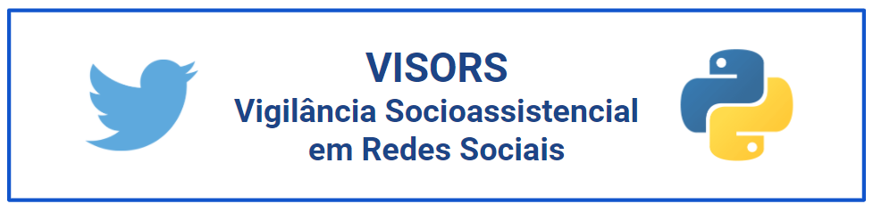

<!--
*** Thanks for checking out this README Template. If you have a suggestion that would
*** make this better, please fork the repo and create a pull request or simply open
*** an issue with the tag "enhancement".
*** Thanks again! Now go create something AMAZING! :D
***
***
***
*** To avoid retyping too much info. Do a search and replace for the following:
*** WANGOMES, visors, twitter_handle, wangom80@gmail.com
-->


<!-- PROJECT SHIELDS -->
<!--
*** I'm using markdown "reference style" links for readability.
*** Reference links are enclosed in brackets [ ] instead of parentheses ( ).
*** See the bottom of this document for the declaration of the reference variables
*** for contributors-url, forks-url, etc. This is an optional, concise syntax you may use.
*** https://www.markdownguide.org/basic-syntax/#reference-style-links
-->
<!--[![Contributors][contributors-shield]][contributors-url]
[![Forks][forks-shield]][forks-url]
[![Stargazers][stars-shield]][stars-url]
[![Issues][issues-shield]][issues-url]
[![MIT License][license-shield]][license-url]
[![LinkedIn][linkedin-shield]][linkedin-url]
-->


<!-- PROJECT LOGO -->
<br />
<p align="center">
  <a href="https://github.com/WANGOMES/visors">
    
  </a>

  <h3 align="center">VISORS</h3>

  <p align="center">VISORS - Vigilância Socioassistencial em Redes Sociais é o produto de um trabalho acadêmico em Sistemas de Informação.
  <br />
    <a href="https://github.com/WANGOMES/visors"><strong>Explore the docs »</strong></a>
    <br />
    <br />
    <a href="https://github.com/WANGOMES/visors">View Demo</a>
    ·
    <a href="https://github.com/WANGOMES/visors/issues">Report Bug</a>
    ·
    <a href="https://github.com/WANGOMES/visors/issues">Request Feature</a>
  </p>
</p>


<!-- TABLE OF CONTENTS -->
## Índice

* [Sobre o VISORS](#sobre-o-visors)
  * [Ferramentas](#ferramentas)
* [Iniciando](#iniciando)
  * [Pré Requisitos](#pré-requisitos)
  * [Instalação](#instalação)
* [Uso](#uso)
* [License](#license)
* [Contato](#contato)
<!--* [Acknowledgements](#acknowledgements)-->


<!-- ABOUT THE PROJECT -->
## Sobre o VISORS

[![Product Name Screen Shot][product-screenshot]]

VISORS - Vigilância Socioassistencial em Redes Sociais é o resultado do trabalho acadêmico intitulado VIGILÂNCIA SOCIOASSISTENCIAL: MONITORAMENTO DE RISCOS E VULNERABILIDADES EM TEMPO REAL POR MEIO DE MINERAÇÃO DE TEXTO NO TWITTER que propõe identificar situações de vulnerabilidade e risco social em tweets.

### Ferramentas

* [Dicionário de Sinônimos](./arquivos/stem_termos.txt) - _Dicionário de Sinônimos dos termos **vulnerabilidade** e **risco** social_
* [Base tweets etiquetados Vulnerabilidade e Risco social]() - _Base de dados SQL com 2.634 tweets etiquetados manualmente_ 
* [municipios_brasileiros_ibge.csv](./arquivos/municipios_brasileiros_ibge.csv) - _Arquivo .csv para validação dos 5.572 municípios brasileiros. Ver [IBGE](https://www.ibge.gov.br/geociencias/downloads-geociencias.html)_
* [Base_controle_municipios_ibge.csv](./arquivos/arq_controle_mun_bra_ibge.csv) - *Arquivo .csv para auxiliar na busca dos municípios brasileiros no arquivo 'municipios_brasileiros_ibge.csv'*


<!-- GETTING STARTED -->
## Iniciando

Para começar é necessário que você tenha o **[Python](https://www.python.org/downloads/)** instalado. No **VISORS** utilizou-se a versão *Python 3.8.2*
Você também precisa:
* Editor de Texto: **[VSCode](https://code.visualstudio.com/download)** - utilizado no trabalho;
* SGBD: **[MySQL](https://www.mysql.com/downloads/)** - utilizado no trabalho.
* API Stream Twitter: **[API_Stream_Twitter](https://developer.twitter.com/en/docs/twitter-api)** - A **Streaming API do Twitter** (API de streaming em tempo real), necessita de uma única conexão aberta entre o Aplicativo cliente (Client App) e a API, diferentemente das APIs REST, que entregam dados em lotes por meio de repetidas solicitações do Client App. É necessário criar uma API em [Twitter](https://developer.twitter.com/en/docs/twitter-api) para ter acesso ao fluxo de dados dos *tweets*. Veja a [Documentação](https://developer.twitter.com/en/doc).


### Pré Requisitos

Para utilização desta aplicação é necessário obter as bibliotecas abaixo:
* [sklearn](https://scikit-learn.org/stable/index.html)
* [nltk](https://www.nltk.org/)
* [pandas](https://pandas.pydata.org/pandas-docs/stable/getting_started/install.html)
* [numpy](https://numpy.org/install/)
* [matplotlib](https://matplotlib.org/3.3.3/users/installing.html)
* [pickle](https://pypi.org/project/pickle5/)
* [wordcloud](https://pypi.org/project/wordcloud/)
* [pymysql](https://pypi.org/project/PyMySQL/)
* [tweepy](http://docs.tweepy.org/en/latest/install.html)


### Instalação

1. Clone do Repositório:
```sh
git clone https://github.com/WANGOMES/visors.git
```
2. Instalação de pacotes / bibliotecas:
```sh
pip install NOME_PACOTE
```


<!-- USAGE EXAMPLES -->
## Uso

Com o objetivo de **contribuir** com a área de **Vigilância Socioassistencial** por meio da **coleta e da análise de dados não estruturados**, o protótipo **VISORS** permite, com uma taxa de **_recall_ de 74%** (classe 'Sim'), identificar situações de ***vulnerabilidade e risco social em tweets*** públicos. 

_Para saber mais, consulte o [Trabalho Acadêmico](https://example.com)_.

<!-- ROADMAP -->
<!--## Roadmap

See the [open issues](https://github.com/WANGOMES/visors/issues) for a list of proposed features (and known issues).

-->

<!-- CONTRIBUTING -->
<!--## Contributing

Contributions are what make the open source community such an amazing place to be learn, inspire, and create. Any contributions you make are **greatly appreciated**.

1. Fork the Project
2. Create your Feature Branch (`git checkout -b feature/AmazingFeature`)
3. Commit your Changes (`git commit -m 'Add some AmazingFeature'`)
4. Push to the Branch (`git push origin feature/AmazingFeature`)
5. Open a Pull Request

-->

<!-- LICENSE -->
## License

Distribuído sob a licença MIT. Veja `LICENSE` para mais informações.


<!-- CONTACT -->
## Contato

Wanderson Gomes - [@Wancog](https://twitter.com/Wancog) - wangom80@gmail.com

Link do Projeto: [https://github.com/WANGOMES/visors](https://github.com/WANGOMES/visors)


<!-- ACKNOWLEDGEMENTS -->
<!--## Acknowledgements

* []()
* []()
* []()-->


<!-- MARKDOWN LINKS & IMAGES -->
<!-- https://www.markdownguide.org/basic-syntax/#reference-style-links -->
<!--[contributors-shield]: https://img.shields.io/github/contributors/WANGOMES/visors.svg?style=flat-square
[contributors-url]: https://github.com/WANGOMES/visors/graphs/contributors
[forks-shield]: https://img.shields.io/github/forks/WANGOMES/visors.svg?style=flat-square
[forks-url]: https://github.com/WANGOMES/visors/network/members
[stars-shield]: https://img.shields.io/github/stars/WANGOMES/visors.svg?style=flat-square
[stars-url]: https://github.com/WANGOMES/visors/stargazers
[issues-shield]: https://img.shields.io/github/issues/WANGOMES/visors.svg?style=flat-square
[issues-url]: https://github.com/WANGOMES/visors/issues
[license-shield]: https://img.shields.io/github/license/WANGOMES/visors.svg?style=flat-square
[license-url]: https://github.com/WANGOMES/visors/blob/master/LICENSE.txt
[linkedin-shield]: https://img.shields.io/badge/-LinkedIn-black.svg?style=flat-square&logo=linkedin&colorB=555
[linkedin-url]: https://linkedin.com/in/WANGOMES-->
[product-screenshot]: ./images/visors.png
